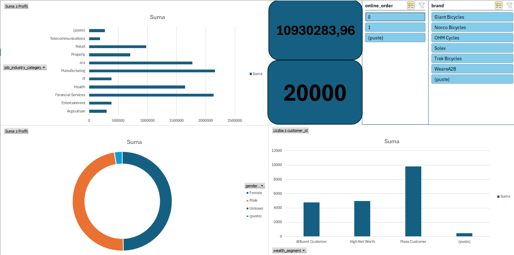
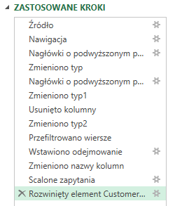
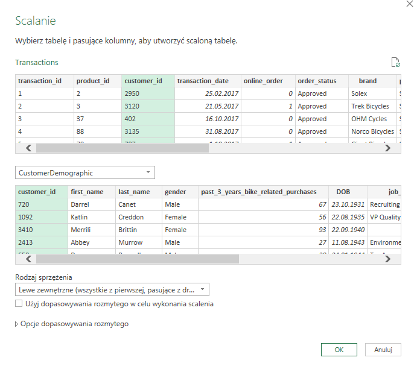

# KPMG Data Quality Assessment & Sales Dashboard (Sprocket Central)

## O projekcie
Projekt analityczny zrealizowany na podstawie rzeczywistego zestawu danych (Sprocket Central Pty Ltd) pochodzącego z wirtualnego stażu KPMG. Głównym celem było przeprowadzenie pełnego procesu analitycznego od ekstrakcji i czyszczenia surowych danych, przez modelowanie, aż po stworzenie w pełni interaktywnego narzędzia wspierającego decyzje biznesowe Zarządu.

**Technologie:** Microsoft Excel (Power Query, Pivot Tables, Pivot Charts, Slicers). 
*Projekt zrealizowany w 100% przy użyciu natywnych narzędzi analitycznych Excela.*

---

## Architektura Rozwiązania i Proces ETL

Projekt został podzielony na trzy logiczne warstwy (Data, Backend, Frontend), co zapewnia wysoką wydajność i przejrzystość raportu. Surowe dane z 3 różnych arkuszy zostały przetworzone przy użyciu **Power Query**.

**Kluczowe operacje przekształcania danych (Data Cleansing):**
* **Promowanie nagłówków:** Ustawienie pierwszego wiersza jako nazw kolumn.
* **Typowanie danych:** Optymalizacja formatów, w tym kluczowa zmiana identyfikatorów (`customer_id`, `product_id`) z typu liczbowego na tekstowy, aby zapobiec błędnym agregacjom, oraz konwersja wartości Prawda/Fałsz na wartości liczbowe/kategoryczne.
* **Usuwanie szumu informacyjnego:** Usunięcie kolumn zawierających wyłącznie wartości `null` oraz odfiltrowanie błędnych i niekompletnych rekordów (np. braki w datach urodzenia, usunięcie rekordów z defaultowymi ciągami znaków).
* **Standaryzacja słowników:** Ujednolicenie zmiennych kategorycznych w kolumnie `gender` (zastąpienie błędnych wpisów 'F', 'Femal', 'U' czystymi kategoriami: 'Male', 'Female', 'Unknown').
* **Obsługa wartości odstających (Outliers):** Identyfikacja i usunięcie absurdalnych dat urodzenia (np. z 1843 roku), które zaburzałyby segmentację wiekową.
* **Modelowanie Danych (Denormalizacja):** Obliczenie nowej miary `Profit` (List Price - Standard Cost). Połączenie tabel (Merge / LEFT JOIN) po kluczu `customer_id` w celu stworzenia płaskiej tabeli faktów, gotowej do budowy relacji w Tabelach Przestawnych.

---

## Interaktywny Dashboard (Frontend)

Zbudowano w pełni interaktywny panel menedżerski oparty na Wykresach Przestawnych, napędzanych ukrytymi w backendzie Tabelami Przestawnymi. 

### Kluczowe elementy rozwiązania:
* **Fragmentatory (Slicers):** Zastosowano globalne filtry (np. `brand`, `online_order`) połączone relacyjnie ze wszystkimi wykresami w raporcie (*Report Connections*), co pozwala użytkownikowi na błyskawiczną i dynamiczną segmentację danych.
* **Karty KPI:** Wdrożono dynamiczne pola tekstowe wyświetlające najważniejsze metryki (np. *Total Transactions*). Zmieniają one swoje wartości w czasie rzeczywistym w odpowiedzi na kliknięcia we fragmentatorach.
* **Data Viz Hygiene:** Zastosowano nowoczesny design, całkowicie pozbawiony szumu wizualnego. Osiągnięto to m.in. poprzez usunięcie linii siatki, wygaszenie domyślnych przycisków pól oraz zastosowanie przemyślanej palety kolorystycznej z elementami formatowania warunkowego.

---

### Zrzuty ekranu z projektu

**1. Widok Głównego Dashboardu** 
*(Gotowy, interaktywny panel analityczny)*

---

**2. Proces ETL i Model Danych (Power Query)** 
*(Zastosowane kroki transformacji danych oraz wizualizacja scalania tabel w modelu relacyjnym)*

---

## Kluczowe Wnioski Biznesowe (Insights)

Na podstawie zbudowanego modelu, zidentyfikowano następujące trendy:
1. **Zyskowność branż:** Najbardziej dochodową grupą docelową są klienci z sektorów **Manufacturing** oraz **Financial Services**. Zdecydowanie najsłabiej performuje branża Telecommunications.
2. **Struktura płci:** Płeć nie stanowi silnego dyferencjatora w ogólnym zysku – generowane marże rozkładają się bardzo równomiernie pomiędzy kobietami i mężczyznami.
3. **Segmentacja zamożności:** Największą liczbę zamówień generuje segment **Mass Customer**, przewyższając łączną liczbę transakcji segmentów High Net Worth i Affluent Customer.